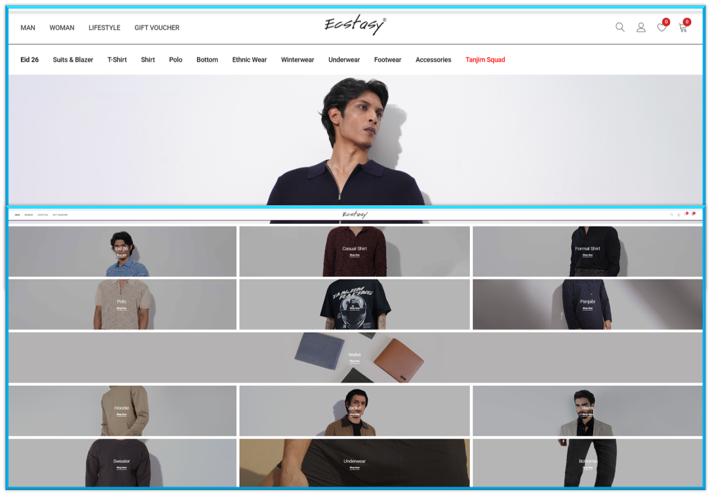
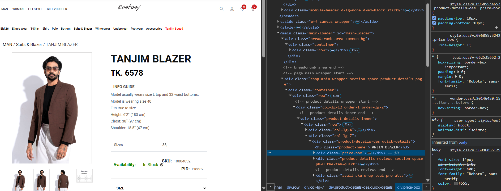
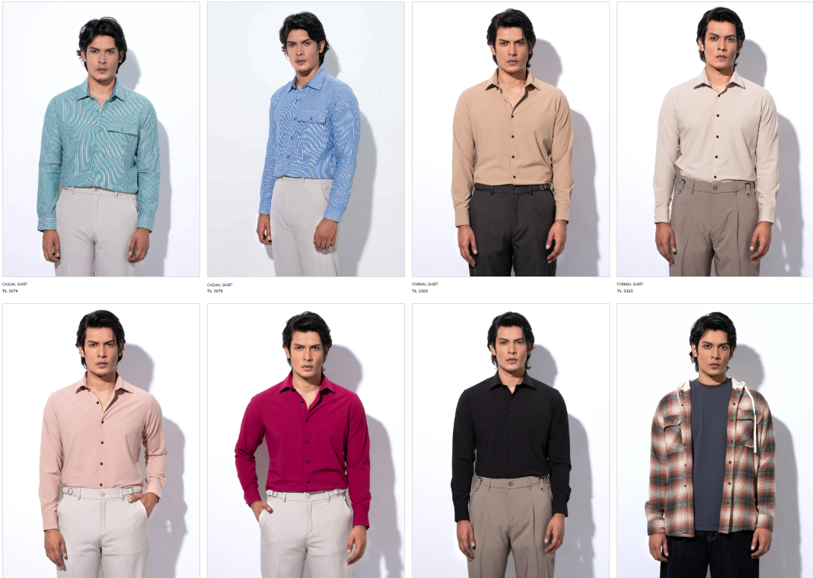
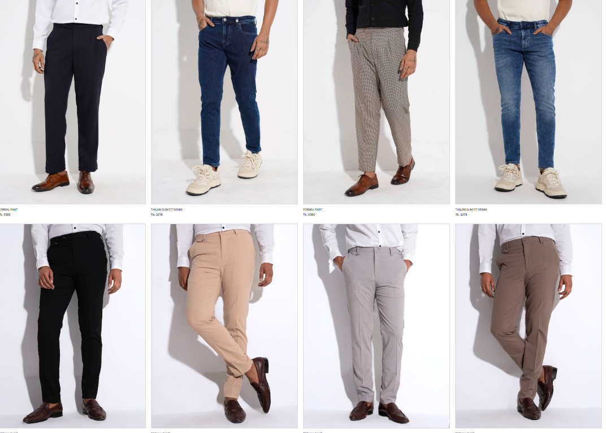
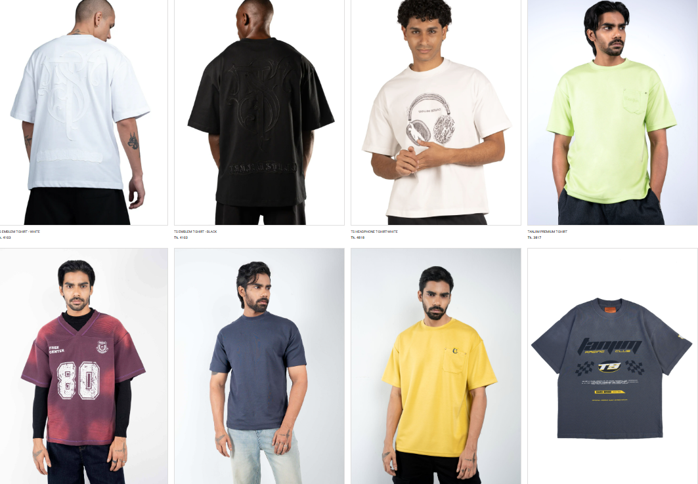
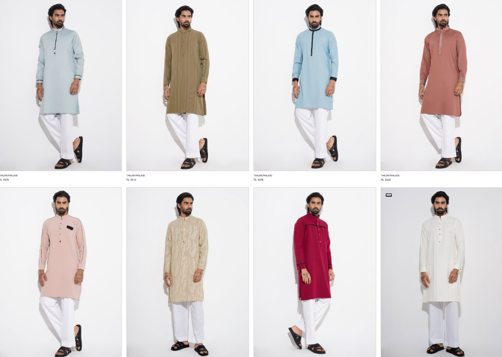
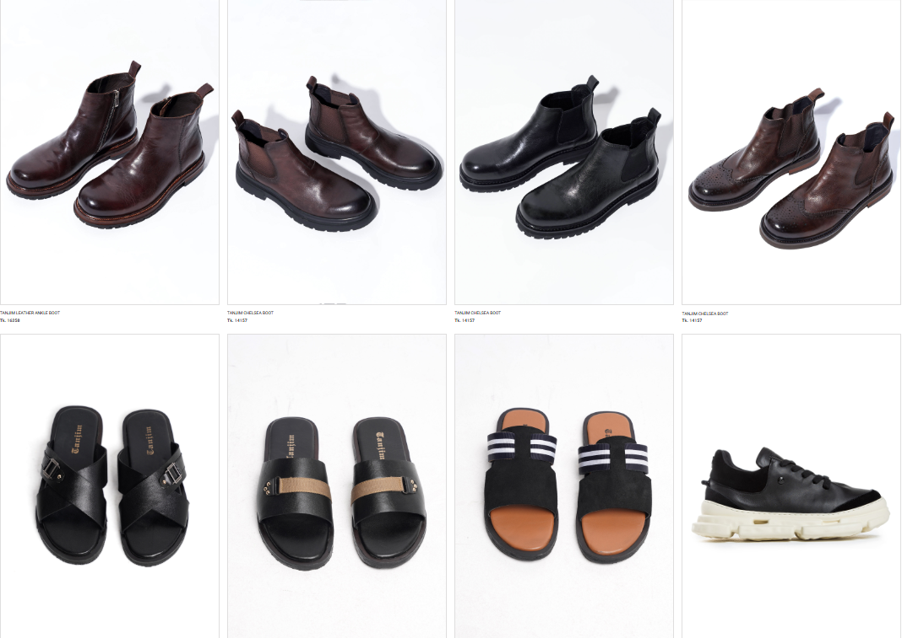

# Men's Collection Data Scraper – Ecommerce Brand

  

This project is a Python-based web scraping system designed to extract structured product data from the **Men’s Collection** section of my favorite online shopping brand.

> The scraper collects product-level information across all major men’s fashion categories and organizes the data for analysis and further processing.

## Product info was displayed like :

  

## Categories Covered :

### 1. Shirts

Product List :

  

Scraped Row Data :

  

---

### 2. Pants

Product List :

  

Scraped Row Data :

  

---

### 3. T-Shirts

Product List :

  

Scraped Row Data :

  

---

### 4. Ethnic Wear

Product List :

  

Scraped Row Data :

  

---

### 5. Footwear

Product List :

  

Scraped Row Data :

  

---

## To Complete this project i used

* `Python`
* `Selenium` - Browser Automation 
* `BeautifulSoup` - HTML parsing 
* `Pandas` - Data transformation and cleaning 
* `Excel` - Saving the final cleaned data

    ## **Thanks for Exploring My Project☺️**

